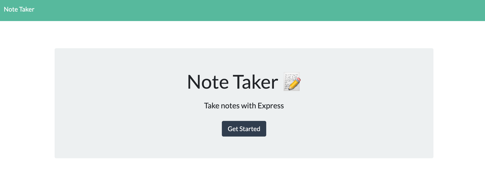
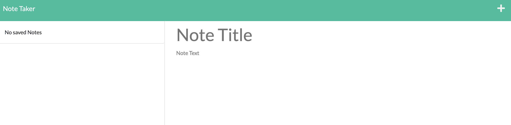
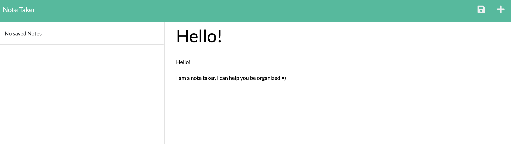
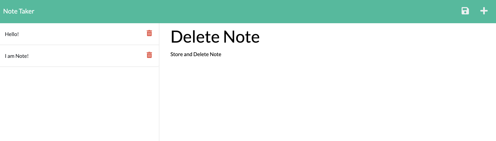

# Note-Taker

Delployed App: https://cryptic-harbor-91774.herokuapp.com/notes

Github Repository: https://github.com/stevaniekanter/Note-Taker

# Description
This is a note taker application that will help user write note, save as well as detele. This will help user stay organized with their task and to-do's.

This App was build using express backend and data retrieval from a JSON file.

# Table of Contents
  * [Installation](#installation)
  * [Usage](#usage)
  * [Screenshot](#screenshot)

# Installation

This app requires npm to be install

npm express

# Usage

This application is used to take and save notes

# Screenshot

Homepage screenshot:

Main page to create, save and delete notes:

Example of uers input text and save button:

Saves notes and  option to delete:

